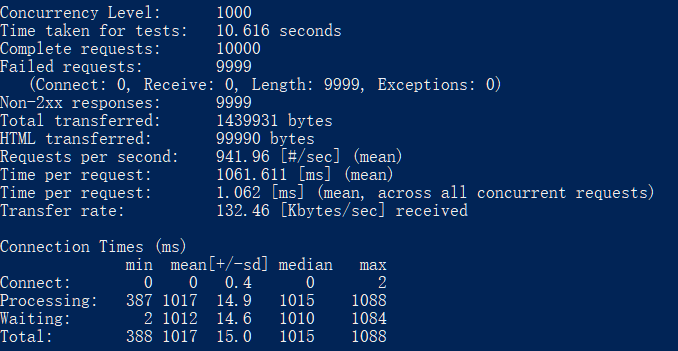
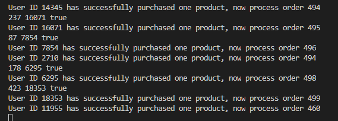

Flash sale has several difficult technical issues. 
The lock of Go channel can prevent
over sale. The Goroutine can handle concurrency.

1.Set the number of product in stock in request.go

products.GetProduct(500)

2. go run request.go

3. ab  -c 1000 -n 10000 http://127.0.0.1:8080/  change the concurrency and requests as you like

result:

